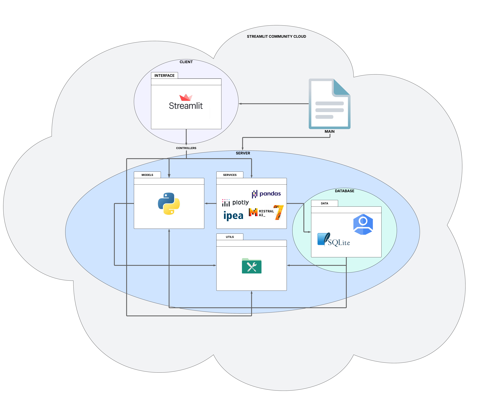
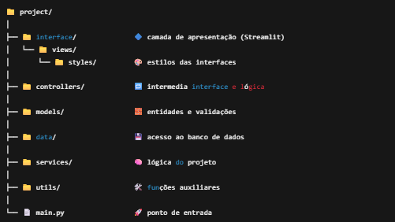

# 📊 GovInsights - Projeto de Geração Automática de Relatórios de Series Financeiras do IPEA

Este projeto tem como objetivo gerar relatórios financeiros automatizados sobre series financeiras do **IPEA** (**Instituto de Pesquisa Econômica Aplicada**) com base em dados de entrada fornecidos pelo usuário. A aplicação foi construída com foco em modularidade, escalabilidade e facilidade de manutenção, utilizando um modelo monolítico modular com aplicação de padrões arquiteturais de arquitetura em camadas e MVC.

---

## 🧱 Arquitetura do Projeto

Optamos por um modelo **monolítico modular**, baseado nos princípios de:
- **Arquitetura em Camadas**
- **Padrão MVC (Model-View-Controller)**

Essa estrutura organiza o sistema em módulos claros e independentes, permitindo que cada parte seja evoluída de forma coesa e sustentável, com baixo acoplamento e alta coesão.

* ### Banco de Dados
    - **Login de Usuários:** A autenticação é realizada através do **Google Identity**, garantindo uma forma segura e prática para os usuários se autenticarem.
    - **Histórico de Relatórios:** O histórico dos relatórios gerados será armazenado no banco de dados local **SQLite**, proporcionando uma solução leve e eficiente para o armazenamento dos dados.
  
* ### Frontend e Backend
    -  **Frontend:** A interface do usuário é construída utilizando **Streamlit**, garantindo uma experiência interativa e visualmente atraente.
    - **Backend:** A lógica de negócio, manipulação de dados de series do IPEA e integração com IA (Mistral 7B) é tratada pelas camadas de **services**, **controllers**, **models**, e **utils**, todas desenvolvidas com **Python**. A tecnologia de **NLP (Processamento de Linguagem Natural)** ainda não foi definida, mas será uma parte essencial da aplicação para melhorar a geração de relatórios e interação com dados.

* ### Visualização da Arquitetura do Projeto



---

## 🗂️ Estrutura do Projeto



---

## 📂 Descrição dos Diretórios

### 🔷`interface/`
- **Função:** Camada de apresentação (UI).
- **Tecnologias:** Streamlit + Python.
- **Responsável por:** Renderizar páginas e coletar inputs do usuário.

### 🔷`controllers/`
- **Função:** Camada de controle.
- **Tecnologias:** Python.
- **Responsável por:** Orquestrar fluxos entre a interface e a lógica de negócio.

### 🔷`services/`
- **Função:** Lógica de negócio.
- **Tecnologias:** Python, API IPEA, Pandas, Mistral 7B (LLM), Plotly, entre outras.
- **Responsável por:**  Realizar a conexão com a biblioteca ipeadatapy para obter as séries financeiras, filtrar, processar e gerar relatórios financeiros detalhados, além de interagir com o modelo de LLM (Mistral 7B) para a geração de relatórios.
- **Nota:** A tecnologia de **NLP (Processamento de Linguagem Natural)** ainda não foi definida, mas será uma parte importante para a geração e aprimoramento dos relatórios financeiros.

### 🔷`models/`
- **Função:** Representação das entidades do sistema.
- **Tecnologias:** Python puro.
- **Responsável por:** Padronizar e encapsular os dados do domínio.

### 🔷`data/`
- **Função:** Persistência e autenticação.
- **Tecnologias:** SQLite (armazenamento), Google Identity (login), Python.
- **Responsável por:** Armazenar histórico de relatórios e gerenciar autenticação de usuários.

### 🔷`utils/`
- **Função:** Funções auxiliares reutilizáveis.
- **Tecnologias:** Python e outras bibliotecas de suporte.
- **Responsável por:** Suporte geral a funções como formatações, logs e conversões.

### 🔷`main.py`
- **Função:** Ponto de entrada da aplicação.
- **Tecnologias:** Python.
- **Responsável por:** Inicialização de dependências e execução da aplicação.

---

## 🔁 Relações Entre Diretórios

| Diretório     | Pode chamar...                              | Pode ser chamado por...                   |
|---------------|----------------------------------------------|-------------------------------------------|
| `interface/`  | `controllers/`                               | `main.py`                                 |
| `controllers/`| `services/`, `models/`, `utils/`             | `interface/`                              |
| `services/`   | `data/`, `models/`, `utils/`                 | `controllers/`                            |
| `models/`     | `utils/` (opcional)                          | `services/`, `controllers/`, `data/`      |
| `data/`       | `models/`, `utils/` (opcional)               | `services/`                               |
| `utils/`      | —                                            | Todos, exceto `interface/` (idealmente)   |
| `main.py`     | Todos                                        | —                                         |

---

## 🚀 Tecnologias Principais

- **Frontend:** Streamlit
- **Backend:** Python
- **Banco de Dados:** SQLite
- **Autenticação:** Google Identity
- **IA:** Mistral 7B
- **Gráficos:** Plotly
- **Manipulação de Dados:** Pandas
- **NLP (Processamento de Linguagem Natural):** Tecnologia ainda não definida

---

## 📌 Requisitos

- Python 3.10+
- Streamlit
- pandas, plotly, mistral-client (ou wrapper), etc.

---

## ▶️ Executando o Projeto

```bash
# Instale as dependências
pip install -r requirements.txt

# Execute a aplicação
streamlit run main.py
```

---

## 🌐 Deploy

* O deploy será realizado utilizando o sistema de nuvem do Streamlit, o ***Streamlit Community Cloud***.
